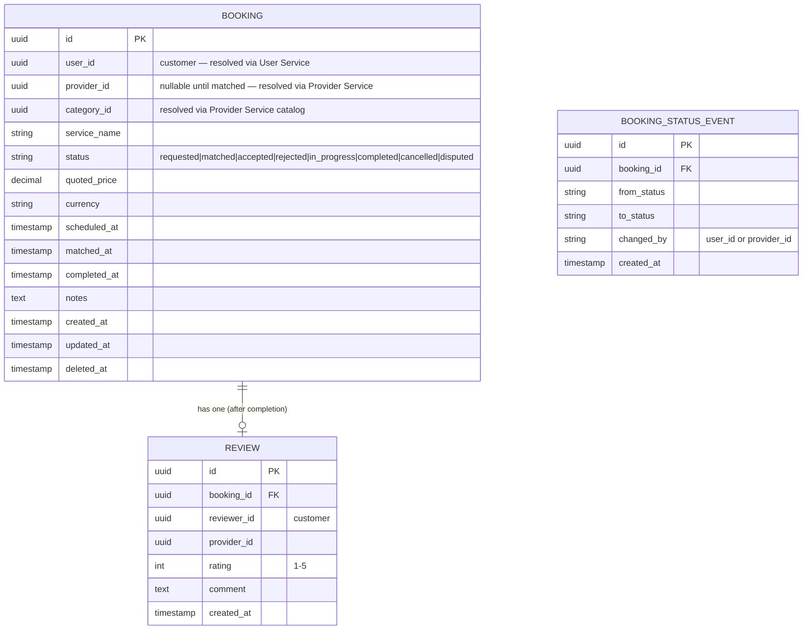
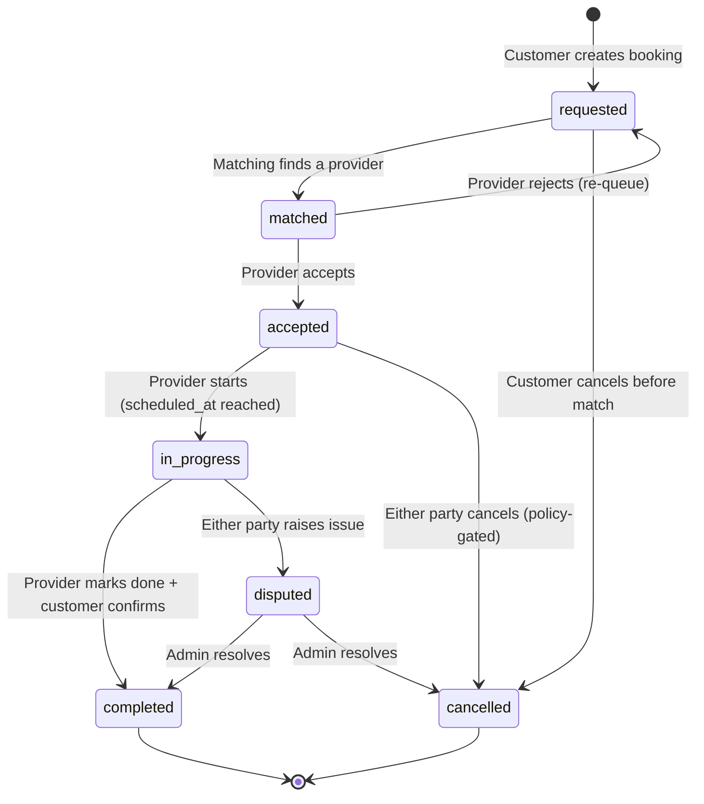
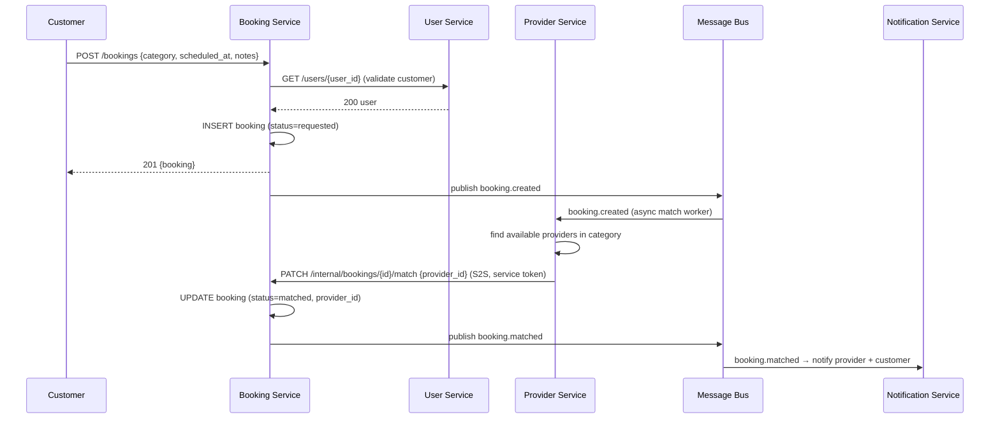
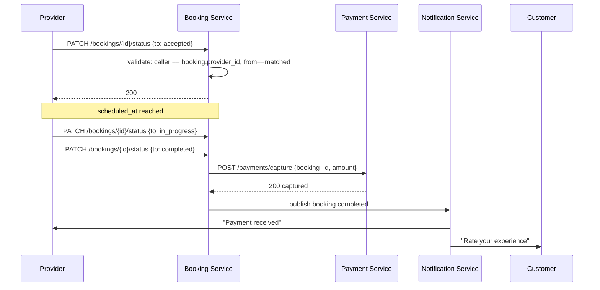

# Service Hiring Platform — High-Level Design

**Status:** Draft
**Owner:** Mohit Chack (mohit.chack@rosstechnologies.in)
**Scope:** Extends `go-helpme-booking` from a single-sided booking API into a two-sided
service-hiring platform (customers hiring service providers — e.g. plumbers,
electricians, cleaners, tutors).

---

## 1. Current State (baseline)

`go-helpme-booking` today is a single Go/Gin/GORM microservice that owns one table
(`bookings`) and resolves `user_id` against a separate **User Service** over HTTP
before every read/write.

```
Client ──JWT──▶ Booking Service ──S2S HTTP (forwards Bearer token)──▶ User Service
                       │
                       ▼
                  Postgres (bookings)
```

Key existing building blocks (reused, not replaced, by this design):

| Concern | Current implementation |
|---|---|
| HTTP framework | Gin, versioned under `/api/v1` (`config.APIV1`) |
| Auth | JWT (HS256), `middleware.Authenticate()` injects `userID`/`role` into context; `middleware.RequireRole()` for RBAC |
| S2S pattern | Bearer token forwarded from the inbound request to downstream services (see `BookingController.lookupUser`) |
| Persistence | GORM over Postgres, one DB per service, `AutoMigrate` on boot |
| Cross-cutting | Recovery, RequestID, structured logging (zap, file+console sinks), CORS, timeout, rate limiting, graceful shutdown drainer |
| Docs | Swagger (`swaggo`), disabled in prod |
| Config | `.env` per environment (`dev`/`qa`/`prod`), secrets loader hook (`config.LoadSecrets`) for prod |

The `Booking` model today is single-sided: it links a booking to a **customer**
(`user_id`) with a free-text `service_name` and a `status` that is set to
`"pending"` and never transitioned. There is no concept of a **provider**, no
matching, no pricing, no payment, and no review loop. That is the gap this HLD
closes.

---

## 2. Goals / Non-Goals

**Goals**
- Introduce **service providers** as a first-class actor who can be discovered,
  assigned, and rated.
- Give a booking a real **lifecycle** (state machine), not a static `"pending"`.
- Keep `go-helpme-booking` as the **system of record for bookings** — it becomes
  the orchestration hub the new services plug into, not a replaced component.
- Extend the platform via **new sibling microservices**, following the same
  pattern already established for the User Service (own DB, own auth
  boundary, called over HTTP with the caller's Bearer token forwarded).
- Preserve the existing non-functional posture: structured logging, rate
  limiting, graceful shutdown, per-env config — every new service inherits the
  same skeleton (this repo is effectively the reference implementation /
  template for it).

**Non-Goals (this revision)**
- Real-time chat / in-app messaging between customer and provider.
- In-house payment processing (PCI scope) — v1 integrates a third-party
  processor (Stripe/Razorpay) rather than building ledgers.
- Provider onboarding/KYC workflow details (separate HLD).
- Mobile push infra design (treated as a black-box Notification Service).

---

## 3. Actors

| Actor | Description |
|---|---|
| **Customer** | Existing `User` (role `user`) who requests a service. |
| **Provider** | New actor type — an individual or business offering services in one or more categories. Has availability, a skill/category list, a rating. |
| **Admin** | Existing `role=admin` — moderates categories, disputes, provider approval. |

Open question for the User Service owner: does `Provider` become a `role` on
the existing `User` model (`role=provider`), or a fully separate identity
(`provider_id` distinct from `user_id`, e.g. for businesses with multiple
staff)? This HLD assumes the latter (separate `Provider` entity that
*references* a `user_id` for login/identity), since it scales better to
multi-person provider businesses. **This is the key decision to confirm before
implementation.**

---

## 4. High-Level Architecture

```
                                 ┌────────────────────┐
                                 │   API Gateway / LB   │
                                 └──────────┬──────────┘
                                            │  JWT (Bearer)
        ┌───────────────────┬──────────────┼───────────────┬────────────────────┐
        ▼                   ▼              ▼               ▼                    ▼
 ┌─────────────┐    ┌───────────────┐ ┌───────────┐ ┌──────────────┐   ┌──────────────────┐
 │ User Service│    │Provider/Catalog│ │  Booking  │ │   Payment    │   │ Notification     │
 │ (existing)  │    │    Service     │ │  Service  │ │   Service    │   │ Service          │
 │             │    │  (new)         │ │(this repo)│ │  (new)       │   │ (new)            │
 └──────┬──────┘    └───────┬────────┘ └─────┬─────┘ └──────┬───────┘   └────────┬─────────┘
        │                   │                │              │                    │
     Postgres           Postgres         Postgres       Postgres/            Email/SMS/Push
     (users)         (providers,       (bookings,      processor ledger        provider
                      categories,       reviews)                              (SendGrid/SES/FCM)
                      availability)
                           │                │
                           └────────┬───────┘
                                    │ async events (booking.created,
                                    │ booking.matched, booking.completed)
                                    ▼
                            ┌───────────────┐
                            │  Message Bus   │  (SQS/NATS/Kafka — pick one, §8)
                            └───────────────┘
```

`go-helpme-booking` (**Booking Service**) is the hub: it is the only service
a client talks to for the booking lifecycle. It fans out synchronously to
User Service and Provider Service for validation/matching, and emits async
events for anything that doesn't need to block the customer-facing response
(notifications, payment capture, rating eligibility).

### 4.1 New services

| Service | Owns | Why separate (not folded into Booking Service) |
|---|---|---|
| **Provider/Catalog Service** | Providers, service categories, skills, availability calendar | Independent write pattern (providers manage their own availability at high frequency); different scaling profile (read-heavy search/browse) |
| **Payment Service** | Payment intents, transactions, payouts to providers | PCI/compliance boundary should be isolated; likely wraps a processor SDK |
| **Notification Service** | Delivery of email/SMS/push for booking events | Fan-out, retry, and template concerns are unrelated to booking domain logic |
| **Review Service** *(optional — can start as a table inside Booking Service)* | Ratings/reviews tied to a completed booking | Called out separately only if review volume/read patterns justify it; low risk to start inside Booking Service and extract later |

Each new service follows the **same skeleton as this repo**: Gin + GORM +
Postgres + zap logging + JWT auth middleware + `/api/v1` versioning +
Swagger + `.env`-per-environment config. That consistency is deliberate —
it's the fastest way to bring a new service to parity with the existing
operational tooling (log format, health checks, rate limiting).

---

## 5. Booking Service — Required Extensions

### 5.1 Data model changes



- `provider_id` is nullable at creation — a booking starts unmatched.
- `BOOKING_STATUS_EVENT` is an append-only audit trail (who moved the booking
  from one state to another, and when) — needed for dispute resolution and
  matches the existing pattern of structured, traceable state (this repo
  already logs every state-changing action via zap; this table makes state
  transitions queryable, not just log-searchable).

### 5.2 Status state machine



This replaces the current behavior where `Create()` hardcodes
`Status: "pending"` and nothing ever transitions it
(`src/services/booking_service.go:36`).

### 5.3 New/changed API surface (under existing `/api/v1`, same auth middleware)

| Method | Path | Change |
|---|---|---|
| `POST` | `/bookings` | **Changed** — no longer takes `provider_id`; creates in `requested` state, triggers async match |
| `GET` | `/bookings` | Unchanged shape, `status` becomes a filterable query param |
| `GET` | `/bookings/{id}` | **New** — single booking detail incl. status history |
| `PATCH` | `/bookings/{id}/status` | **New** — role-gated transition (`RequireRole` + ownership check: only the assigned provider or the owning customer or an admin may transition) |
| `POST` | `/bookings/{id}/cancel` | **New** — customer- or provider-initiated cancel, policy-checked |
| `GET` | `/bookings/{id}/reviews` | **New** (if reviews live here) |
| `POST` | `/bookings/{id}/reviews` | **New** — only after `status=completed`, only by the customer |

### 5.4 New dependency: Provider Service client

Mirrors `clients.UserServiceClient` exactly:

```go
// src/clients/provider_http_client.go
type ProviderServiceClient struct {
    *helpers.HTTPClient
}
func (c *ProviderServiceClient) GetByID(ctx, providerID string) (*Provider, error)
func (c *ProviderServiceClient) FindMatches(ctx, categoryID string, at time.Time) ([]Provider, error)
```

Same S2S pattern: forward the caller's `Authorization` header via
`helpers.WithHeaders`, same `ErrProviderNotFound` sentinel pattern as
`ErrUserNotFound`.

---

## 6. Key Workflows

### 6.1 Booking creation + matching



Matching runs **async** so booking creation stays fast and doesn't couple the
customer-facing response time to provider-search latency. The Provider
Service calls back into Booking Service over an **internal, service-token
authenticated** endpoint (not the customer-facing JWT) — this is a new
concept for this repo (today it only ever calls *out* to User Service, it
never receives inbound S2S calls) and needs its own middleware
(`middleware.AuthenticateService()` checking a shared service secret or
mTLS, separate from `middleware.Authenticate()`).

### 6.2 Provider accept/reject → in-progress → completion



Every transition writes a `BOOKING_STATUS_EVENT` row and is guarded by a
transition table (only whitelisted `from → to` pairs are legal, checked
server-side — never trust the client to send a valid transition).

---

## 7. Security Model

Extends the existing model rather than replacing it:

- **Customer/Provider-facing calls**: JWT Bearer, same `middleware.Authenticate()`.
  `Claims.Role` gains a new value: `provider` (alongside existing
  `user`/`admin`). `middleware.RequireRole("provider")` gates
  provider-only endpoints exactly as it already does for `admin`.
- **Ownership checks**: role alone isn't enough — a provider must only
  transition *their own* assigned booking. This needs a new authorization
  check beyond `RequireRole` (compare `claims.UserID` against
  `booking.ProviderID`'s linked user), added at the controller/service layer.
- **S2S (outbound)**: unchanged pattern — forward the inbound Bearer token
  (`helpers.WithHeaders`) when Booking Service calls User/Provider Service on
  a customer's behalf.
- **S2S (inbound, new)**: Provider Service → Booking Service callbacks
  (§6.1) are *not* on behalf of a logged-in user, so they can't reuse a
  forwarded Bearer token. Introduce a shared-secret or mTLS service-auth
  layer (`X-Service-Name` header already exists in `config.HeaderServiceName`
  but is currently unused — this is the natural place to wire it up, paired
  with a signed service token instead of trusting the header alone).
- **Payments**: Payment Service never sees raw card data — it's a thin
  wrapper over a PCI-compliant processor (Stripe/Razorpay Connect for
  provider payouts).

---

## 8. Non-Functional Considerations

| Concern | Approach |
|---|---|
| **Async transport** | Any message bus works given the pattern above; pick based on existing infra rather than this HLD mandating one — SQS if already on AWS, NATS/Kafka if self-hosting. The contract that matters is the event names (`booking.created`, `booking.matched`, `booking.completed`, `booking.cancelled`), not the transport. |
| **Idempotency** | Match/callback endpoints (§6.1) must be idempotent (`booking_id` + expected `from_status` as a compare-and-swap) since message buses give at-least-once delivery. |
| **Observability** | Every new service reuses the existing zap logger + file/console sinks + `RequestID` middleware so logs correlate across services via the same request ID header. |
| **Rate limiting** | Existing `middleware.RateLimit` per-IP limiter applies as-is; internal S2S endpoints should be excluded from IP rate limiting and instead capped by service-identity. |
| **DB-per-service** | Each new service gets its own Postgres database (matches the existing "Booking Service owns `bookings`, User Service owns `users`" boundary) — no cross-service joins, only HTTP calls. |
| **Backward compatibility** | `GET /bookings` and `POST /bookings` response shapes should stay additive (new nullable fields only) so existing clients don't break during rollout. |

---

## 9. Phased Rollout

1. **Phase 1 — Booking lifecycle** (this repo only): add `provider_id`
   (nullable), `BOOKING_STATUS_EVENT`, status state machine + transition
   guard, `PATCH /bookings/{id}/status`. No new services yet — provider
   assignment is manual/admin-set for now. Ships value immediately (proper
   status tracking) without waiting on new services.
2. **Phase 2 — Provider/Catalog Service**: stand up the new service,
   `ProviderServiceClient`, wire real matching (even if "matching" v1 is just
   "first available provider in category").
3. **Phase 3 — Async eventing + Notifications**: introduce the message bus,
   move matching off the synchronous request path, add Notification Service.
4. **Phase 4 — Payments**: integrate processor, capture-on-completion flow.
5. **Phase 5 — Reviews & ratings**, feeding back into Provider Service's
   matching ranking.

Each phase is independently shippable and the Booking Service's public API
stays stable throughout (additive changes only), which matters most because
it's the one surface every client depends on directly.

---

## 10. Open Questions

1. Is `Provider` a role on the existing `User` model or a separate entity
   (assumed separate, §3) — needs sign-off from whoever owns the User
   Service.
2. Who resolves pricing — customer sets a budget, provider quotes, or fixed
   per-category pricing? Affects whether `quoted_price` is set at creation or
   at match time.
3. Cancellation policy (fees, notice windows) — needed before `POST
   /bookings/{id}/cancel` can be implemented, currently a stub in the state
   machine.
4. Message bus choice (§8) — depends on where this ends up being deployed;
   not blocking for Phase 1.
